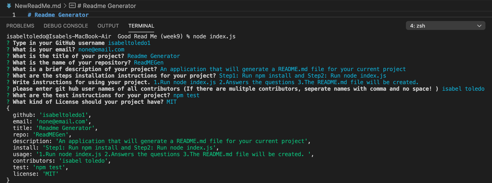

# GoodReadMe 


### Desription

This application will allow the user to quickly and easily create a README file by using a command-line application to generate one. This allows the project creator to devote more time to working on the project.


 
  
### Video Walkthrough
    
  https://drive.google.com/file/d/1d4sWk96IMITFqJr_xgOGy9QT9fob2kqK/view


### Installation
```
run command line npm i
```

### Instructions
```
- Run command line node index.js
- Answer the prompts to create a new README.md
```

### Technologies Used:
 - HTML
 - JavaScript 
 - Node.js
 - Inquirer package